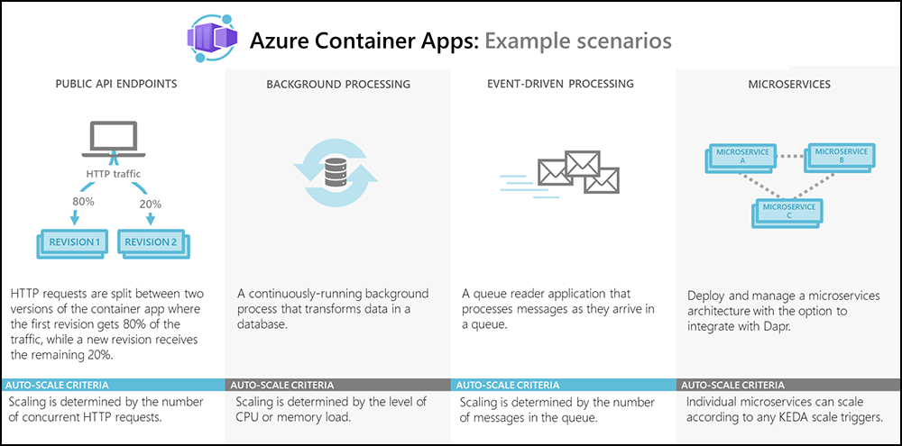
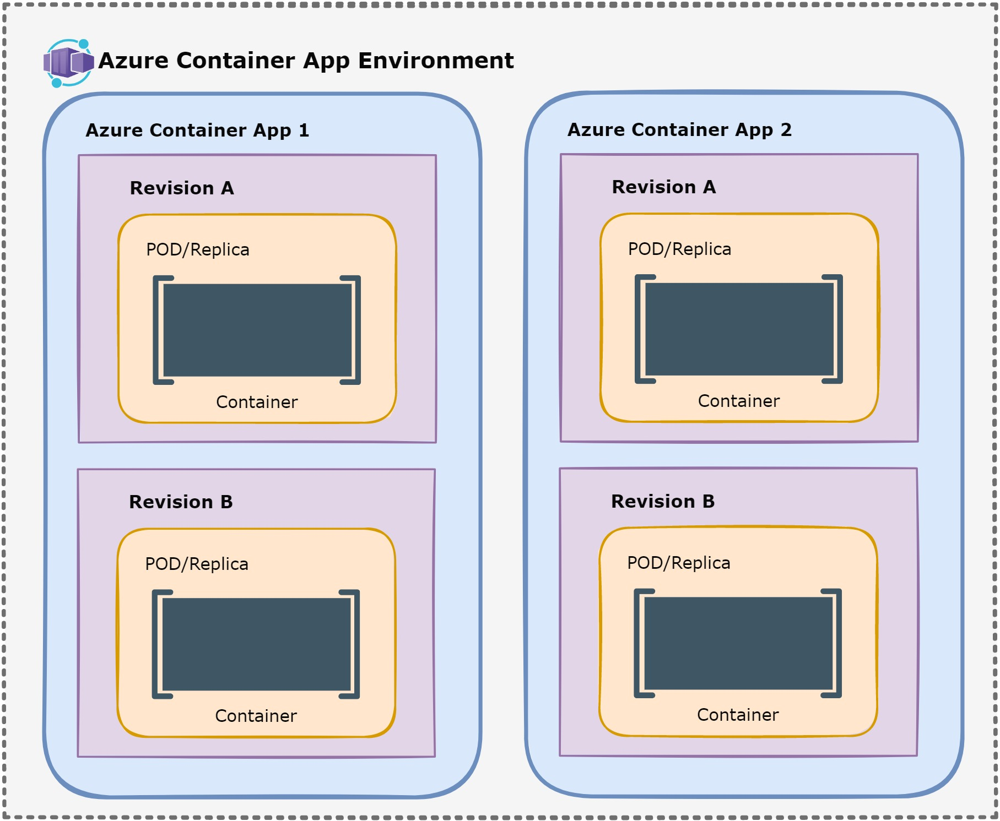

# Container Apps Overview

[Azure Container Apps](https://docs.microsoft.com/en-us/azure/container-apps)is a new serverless container platform for applications that need to scale on demand in response to HTTPS requests, events, or simply run as always-on services or background job processing without managing VMs, orchestrators, or other cloud infrastructure. Azure Container Apps makes it easy to manage your containerized applications with built-in autoscaling, traffic routing, application lifecycle management, and service-to-service communication in a fully managed environment.

While App Service, Functions, and Logic Apps provide application developers with fully-managed, high-productivity solutions for domain-specific problems, customers have to drop out of the fully-managed world and fall back to Kubernetes for full microservice applications or to run general purpose container applications. Azure container Apps fills this gap and rounds out the Azure application platform by providing high-level APIs for the most common container application scenarios, including auto-scaling, version management, application upgrades, and service-to-service communication in a fully managed environment.

Common uses for Azure Container Apps include:

- Deploying API endpoints
- Hosting background processing applications
- Handling event-driven processing
- Running microservices

Applications built on Azure Container Apps can dynamically scale based on the following characteristics:

- HTTP traffic
- Event-driven processing
- CPU or memory load
- Any [KEDA-supported scaler](https://keda.sh/docs/2.4/scalers/)

Azure Container Apps enables executing application code packaged in any container and is unopinionated about runtime or programming model. With Container Apps, you enjoy the benefits of running containers while leaving behind the concerns of managing cloud infrastructure and complex container orchestrators.

With Azure Container Apps, you can:

- [**Run multiple container revisions**](https://docs.microsoft.com/en-us/azure/container-apps/application-lifecycle-management) and manage the container app's application lifecycle.

- [**Autoscale**](https://docs.microsoft.com/en-us/azure/container-apps/scale-app) your apps based on any KEDA-supported scale trigger. Most applications can scale to zero1.

- [**Enable HTTPS ingress**](https://docs.microsoft.com/en-us/azure/container-apps/ingress) without having to manage other Azure infrastructure.

- [**Split traffic**](https://docs.microsoft.com/en-us/azure/container-apps/revisions) across multiple versions of an application for Blue/Green deployments and A/B testing scenarios.

- [**Use internal ingress and service discovery**](https://docs.microsoft.com/en-us/azure/container-apps/connect-apps) for secure internal-only endpoints with built-in DNS-based service discovery.

- [**Build microservices with Dapr**](https://docs.microsoft.com/en-us/azure/container-apps/microservices) and access its rich set of APIs.

- [**Run containers from any registry**](https://docs.microsoft.com/en-us/azure/container-apps/containers), public or private, including Docker Hub and Azure Container Registry (ACR).

- [**Use the Azure CLI extension or ARM templates**](https://docs.microsoft.com/en-us/azure/container-apps/get-started) to manage your applications.

- [**Securely manage secrets**](https://docs.microsoft.com/en-us/azure/container-apps/secure-app) directly in your application.

- [**View application logs**](https://docs.microsoft.com/en-us/azure/container-apps/monitor) using Azure Log Analytics.

1 Applications that [scale on CPU or memory load](https://docs.microsoft.com/en-us/azure/container-apps/scale-app) can't scale to zero.

## Core Components

The main components of Azure Container Apps are:

**1. Environments**
The Environment is a secure boundary around several Container Apps. It contains one or more container apps. All container apps within an environment are deployed into a dedicated Azure Virtual Network, which makes it possible for these different container apps to communicate securely. In addition, all the logs produced from all container apps in the environment are sent to a dedicated Log Analytics workspace.

**2. Log Analytics Workspace**
Used to provide monitoring and observability functionality. Each environment will have its own Log Analytic workspace and will be shared among all container apps within the environment.

**3. Container Apps**
Each container App represents a single deployable unit that can contain one or more related containers. More than one container is an advanced use case. For this workshop we will deploy a single container in each container app. More about multiple containers in the same single Azure Container App can be found [here](https://docs.microsoft.com/en-us/azure/container-apps/containers#multiple-containers).

**4. Revisions**
For each container app, you can create up to 100 revisions. Revisions are a way to deploy multiple versions of an app where you have the option to send the traffic to a certain revision. You can select if revision mode will support 1 active revision or multiple active revisions at the same time to support A/B testing scenarios or canary deployments. A container app running in single revision mode will have a single revision that is backed by zero-many Pods/replicas.

**5. Containers**
Containers in the Azure Container Apps are grouped together in pods/replicas inside revision snapshots. A Pod/replica is composed of the application container and any required sidecar containers. Containers can be deployed from any public or private container registry, and they support any Linux-based x86-64 (linux/amd64) images. At the time of creating this workshop Windows based images are not supported.